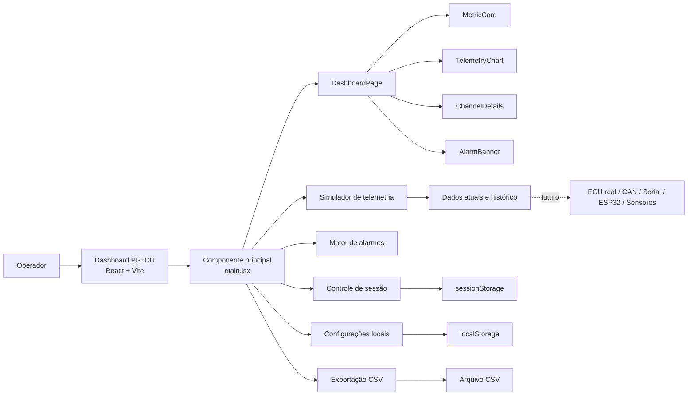
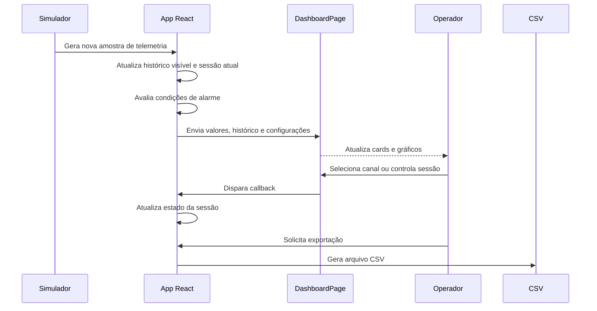
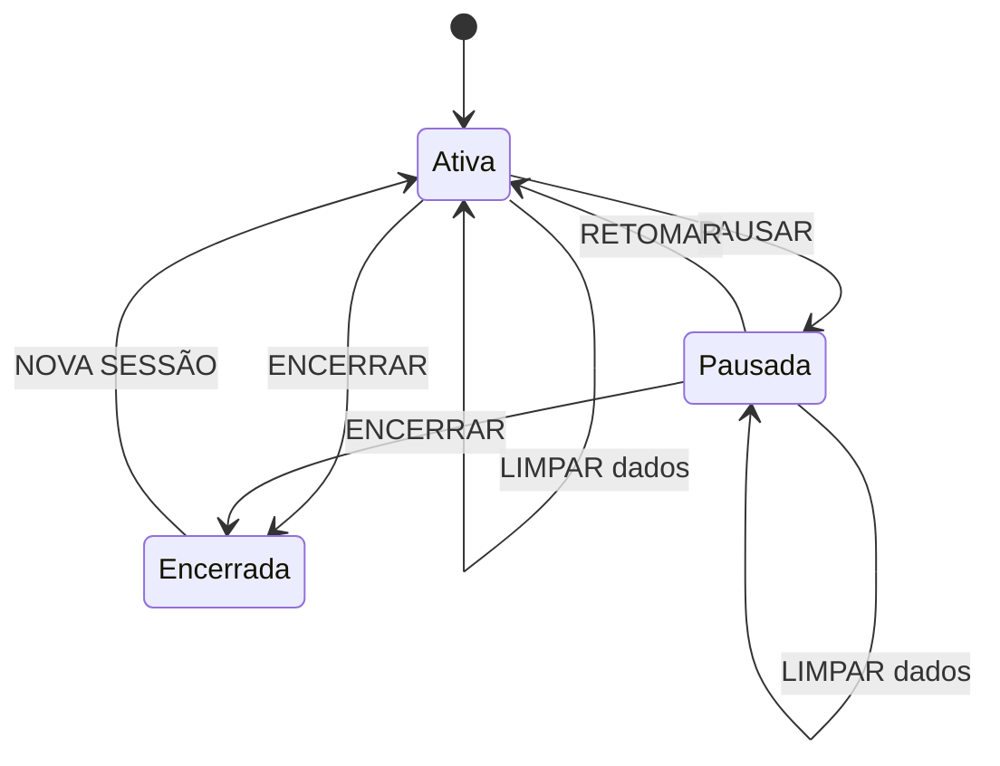

# PI-ECU — Plataforma de Telemetria e Simulação de ECU

> Plataforma acadêmica para **simulação, visualização e análise de telemetria automotiva**. O projeto reúne um dashboard web em React, geração de dados de motor, controle de sessões, alarmes, exportação CSV e uma base preparada para futuras integrações com hardware.


---

## Sumário

- [Sobre o projeto](#sobre-o-projeto)
- [Objetivos](#objetivos)
- [Arquitetura](#arquitetura)
- [Funcionalidades](#funcionalidades)
- [Tecnologias](#tecnologias)
- [Canais de telemetria](#canais-de-telemetria)
- [Interface](#interface)
- [Sessões](#sessões)
- [Alarmes](#alarmes)
- [Simulação](#simulação)
- [Exportação CSV](#exportação-csv)
- [Modo Display](#modo-display)
- [Estrutura do projeto](#estrutura-do-projeto)
- [Instalação](#instalação)
- [Uso](#uso)
- [Fluxo de trabalho Git](#fluxo-de-trabalho-git)
- [Solução de problemas](#solução-de-problemas)
- [Limitações conhecidas](#limitações-conhecidas)
- [Evoluções futuras](#evoluções-futuras)
- [Imagens do projeto](#imagens-do-projeto)
- [Licença e autoria](#licença-e-autoria)

---

## Sobre o projeto

O **PI-ECU** é uma plataforma de telemetria automotiva voltada a fins acadêmicos, didáticos e experimentais. A aplicação simula o comportamento de canais normalmente presentes em uma ECU e apresenta as informações em um dashboard visual inspirado em interfaces de instrumentação e gerenciamento eletrônico de motores.

A versão atual executa no navegador e gera dados simulados de motor em tempo real. O usuário pode acompanhar os valores, selecionar canais, controlar sessões de teste, pausar e retomar a simulação, observar alarmes e exportar os registros em CSV.

O projeto foi estruturado para permitir evolução gradual: primeiro como simulador web, depois como interface para dados externos — por serial, CAN, sensores, Raspberry Pi, ESP32 ou uma ECU real, conforme a arquitetura futura escolhida.

| Item | Informação |
|---|---|
| Projeto | PI-ECU — Plataforma de Telemetria e Simulação de ECU |
| Tipo | Dashboard web de telemetria automotiva |
| Frontend | React + Vite |
| Linguagem principal | JavaScript / JSX |
| Estilo visual | Speed Tech / instrumentação automotiva |
| Fonte atual de dados | Simulação no navegador |
| Armazenamento local | `localStorage` e `sessionStorage` |
| Exportação | CSV de sessão |
| Estado | Em desenvolvimento |
| Uso | Acadêmico, didático e experimental |

---

## Objetivos

- Simular canais de telemetria de uma ECU.
- Criar uma interface visual para acompanhamento em tempo real.
- Exibir métricas principais do motor em cards coloridos.
- Permitir seleção de canais e visualização em gráficos.
- Criar, pausar, retomar, encerrar e limpar sessões de teste.
- Registrar amostras de telemetria durante uma sessão.
- Exportar dados em formato CSV.
- Avaliar condições de alarme com base nas leituras atuais.
- Criar uma base de software preparada para integração com hardware futuro.
- Manter uma organização modular de componentes, páginas, dados e utilitários.

---

## Arquitetura



### Fluxo de telemetria



---

## Funcionalidades

| Recurso | Descrição | Estado |
|---|---|---|
| Telemetria simulada | Geração de valores dinâmicos de motor em intervalos regulares | Funcionando |
| Cards principais | Exibição de RPM, MAP, TPS, Lambda, ECT e bateria | Funcionando |
| Gráfico principal | Visualização de canais selecionados em tempo real | Funcionando |
| Canal em detalhe | Gráfico dedicado ao canal selecionado | Configurável |
| Canais secundários | Cards selecionáveis para outros sensores | Configurável |
| Alarmes | Avaliação de condições críticas e alertas | Funcionando |
| Sessões | Nova sessão, pausa, retomada, encerramento e limpeza | Funcionando |
| Exportação | Geração de CSV com dados da sessão | Funcionando |
| Configurações | Seleção de canais, grade, legenda e layout | Funcionando |
| Modo Display | Layout ampliado para monitoramento | Funcionando |
| Tela cheia | Uso da API Fullscreen do navegador | Funcionando |
| Persistência local | Configurações e sessão atual no navegador | Funcionando |
| Hardware externo | Dados reais de ECU/sensores | Planejado |

---

## Tecnologias

| Tecnologia | Uso |
|---|---|
| React | Componentização e controle de estado da interface |
| Vite | Ambiente de desenvolvimento e build |
| JavaScript / JSX | Lógica da aplicação e componentes |
| CSS | Tema visual, responsividade e modo Display |
| Recharts | Gráficos de telemetria |
| `localStorage` | Persistência das preferências do dashboard |
| `sessionStorage` | Persistência temporária da sessão atual |
| Blob API | Exportação de arquivos CSV no navegador |
| Git / GitHub | Controle de versão e colaboração |

---

## Canais de telemetria

A simulação atual trabalha com canais representativos de uma ECU. Cada canal possui identificador, rótulo, unidade e cor associada à interface.

| Canal | Identificador | Unidade | Descrição |
|---|---|---:|---|
| RPM | `rpm` | rpm | Rotação do motor |
| MAP | `map_kpa` | kPa | Pressão absoluta no coletor |
| TPS | `tps` | % | Posição da borboleta |
| Lambda | `lambda1` | λ | Mistura ar-combustível relativa |
| Combustível | `fuel_bar` | bar | Pressão de combustível |
| Óleo | `oil_bar` | bar | Pressão de óleo |
| ECT | `ect_c` | °C | Temperatura do motor |
| IAT | `iat_c` | °C | Temperatura do ar de admissão |
| Bateria | `battery_v` | V | Tensão do sistema elétrico |

### Modelo de simulação

A simulação usa variação aleatória controlada e relações simples entre os canais. Um exemplo é o RPM acompanhando a abertura do TPS:

```js
const rpmTarget = 850 + tps * 42;
```

A pressão de coletor também acompanha o TPS:

```js
const mapTarget = 30 + tps * 1.7;
```

Essas relações não substituem um modelo físico de motor ou dados de ECU reais. Elas servem para produzir comportamento visual coerente e testar o dashboard.

---

## Interface

A interface foi construída com uma identidade visual de instrumentação automotiva, usando cores de estado e tipografia monoespaçada nos dados técnicos.

### Elementos principais

```text
┌──────────────────────────────────────────────────────────────┐
│ PI-ECU DASHBOARD                         DISPLAY | CSV | CFG  │
│ MODO SIMULAÇÃO — NENHUM HARDWARE CONECTADO                    │
├──────────────────────────────────────────────────────────────┤
│ STATUS DO SISTEMA / ALARMES                                   │
├──────────────────────────────────────────────────────────────┤
│ SESSÃO #001 | DURAÇÃO | AMOSTRAS | CONTROLES                  │
├──────────────────────────────────────────────────────────────┤
│ RPM │ MAP │ TPS │ LAMBDA │ ECT │ BATERIA                      │
├──────────────────────────────────────────────────────────────┤
│ TELEMETRIA EM TEMPO REAL                                      │
│ GRÁFICO PRINCIPAL                                              │
├──────────────────────────────────────────────────────────────┤
│ CANAIS SECUNDÁRIOS / CANAL EM DETALHE                         │
└──────────────────────────────────────────────────────────────┘
```

### Cores de estado

| Cor | Uso principal |
|---|---|
| Verde | Sistema normal, bateria, Lambda, ação principal |
| Ciano | Dados, MAP, destaque e configurações |
| Vermelho | RPM, ECT, alarmes e ações destrutivas |
| Amarelo | Exportação e alertas |
| Roxo | TPS |
| Laranja | Pressão de óleo |

---

## Sessões

Uma sessão representa um período de coleta de telemetria. Durante uma sessão, as amostras geradas são mantidas em memória e podem ser exportadas.

### Estados da sessão



### Controles

| Controle | Função |
|---|---|
| `NOVA SESSÃO` | Cria uma nova sessão, reinicia cronômetro e histórico atual |
| `PAUSAR` | Interrompe atualização de telemetria e cronômetro |
| `RETOMAR` | Continua a sessão pausada sem perder o tempo acumulado |
| `ENCERRAR` | Finaliza a sessão e interrompe a coleta |
| `EXPORTAR CSV` | Gera arquivo com as amostras da sessão |
| `LIMPAR` | Remove amostras atuais e reinicia a visualização |

### Persistência

A aplicação utiliza:

```text
localStorage
```

para armazenar configurações como canais do gráfico e modo Display, e:

```text
sessionStorage
```

para preservar temporariamente dados da sessão durante a navegação ou atualização da página.

---

## Alarmes

O motor de alarmes avalia o estado atual da telemetria e pode sinalizar condições críticas ou de atenção.

Exemplos de condições que podem ser monitoradas:

- Temperatura de motor elevada.
- Pressão de óleo baixa.
- Pressão de combustível inadequada.
- Bateria fora da faixa esperada.
- RPM acima de limite operacional.
- Lambda fora da faixa desejada.

A interface apresenta um banner de status do sistema e, quando necessário, uma lista de alarmes ativos com prioridade visual.

> Os limites atuais são voltados à simulação e devem ser revisados antes de qualquer integração com motor real.

---

## Simulação

O painel funciona inicialmente sem hardware conectado. A geração de telemetria ocorre em intervalos de aproximadamente um segundo e atualiza:

```text
RPM
MAP
TPS
Lambda
Pressão de combustível
Pressão de óleo
ECT
IAT
Bateria
```

### Painel de simulação

O painel de simulação permite ajustar valores iniciais e aplicar cenários durante os testes da interface.

Casos de uso:

- Simular aceleração elevando TPS e RPM.
- Simular temperatura alta para testar alarme de ECT.
- Ajustar Lambda para condição rica ou pobre.
- Alterar tensão da bateria.
- Testar comportamento dos gráficos sem hardware físico.

---

## Exportação CSV

A exportação utiliza os dados acumulados da sessão atual. O arquivo é gerado no navegador e baixado localmente.

Nome esperado:

```text
pi-ecu-sessao-001.csv
```

Exemplo de estrutura:

```csv
time,rpm,map_kpa,tps,lambda1,fuel_bar,oil_bar,ect_c,iat_c,battery_v
12:01:00,2500,120.0,40.0,0.94,3.25,3.48,85.0,35.2,13.7
12:01:01,2635,123.1,42.0,0.95,3.29,3.56,85.1,35.5,13.6
```

A exportação é feita com `Blob` e `URL.createObjectURL`, sem acesso direto ao sistema de arquivos do computador.

---

## Modo Display

O modo Display ajusta o dashboard para monitoramento visual, ampliando áreas importantes sem remover os controles operacionais essenciais.

No modo Display permanecem acessíveis:

- `SAIR DISPLAY`;
- `TELA CHEIA`;
- `CSV SESSÃO`;
- `CONFIGURAÇÕES`.

O painel de simulação pode ser ocultado nesse modo para reduzir distrações durante a visualização.

---

## Estrutura do projeto

Estrutura de referência atual:

```text
pi-ecu/
├── public/
├── src/
│   ├── components/
│   │   ├── AlarmBanner.jsx
│   │   ├── ChannelDetails.jsx
│   │   ├── MetricCard.jsx
│   │   ├── SimulationPanel.jsx
│   │   ├── StatusBar.jsx
│   │   └── TelemetryChart.jsx
│   ├── data/
│   │   └── channels.js
│   ├── pages/
│   │   └── DashboardPage.jsx
│   ├── utils/
│   │   ├── alarms.js
│   │   ├── csvExport.js
│   │   └── sessionDb.js
│   ├── main.jsx
│   └── style.css
├── index.html
├── package.json
├── vite.config.js
└── README.md
```

### Responsabilidade dos arquivos

| Arquivo | Responsabilidade |
|---|---|
| `src/main.jsx` | Estado global da aplicação, simulação, sessões, fullscreen e configurações |
| `src/pages/DashboardPage.jsx` | Organização visual da tela principal |
| `src/components/MetricCard.jsx` | Card individual de métrica |
| `src/components/TelemetryChart.jsx` | Gráfico de telemetria |
| `src/components/ChannelDetails.jsx` | Detalhamento do canal selecionado |
| `src/components/AlarmBanner.jsx` | Apresentação de alarmes ativos |
| `src/components/SimulationPanel.jsx` | Controles de simulação manual |
| `src/data/channels.js` | Definições dos canais de telemetria |
| `src/utils/alarms.js` | Regras de avaliação de alarmes |
| `src/utils/csvExport.js` | Geração e download do CSV |
| `src/utils/sessionDb.js` | Utilitários de persistência de sessão |
| `src/style.css` | Tema, layout, responsividade e modo Display |

---

## Instalação

### Pré-requisitos

- [Node.js](https://nodejs.org/) LTS.
- npm.
- Git.
- Navegador moderno.

### Clonar o projeto

```bash
git clone https://github.com/Matheus44444/pi-ecu.git
cd pi-ecu
```

### Instalar dependências

```bash
npm install
```

### Executar em desenvolvimento

```bash
npm run dev
```

O Vite exibirá uma URL local, normalmente semelhante a:

```text
http://localhost:5173
```

Para abrir em outro dispositivo da mesma rede, use o endereço LAN exibido pelo Vite, por exemplo:

```text
http://192.168.x.x:5173
```

### Build de produção

```bash
npm run build
```

O build deve terminar sem erros antes de criar um commit ou abrir Pull Request.

---

## Uso

### Início rápido

1. Execute `npm run dev`.
2. Abra a URL local no navegador.
3. Observe a telemetria simulada nos cards e no gráfico.
4. Use `CONFIGURAÇÕES` para selecionar canais e elementos visuais.
5. Clique em `NOVA SESSÃO` para iniciar uma nova coleta.
6. Use `PAUSAR` e `RETOMAR` para controlar a atualização.
7. Clique em `EXPORTAR CSV` para baixar os dados.
8. Use `DISPLAY` para ampliar o modo de monitoramento.

### Monitoramento em tela cheia

1. Clique em `DISPLAY`.
2. Clique em `TELA CHEIA`.
3. Use `SAIR DISPLAY` quando quiser retornar ao layout normal.

### Configurações disponíveis

- Canais do gráfico principal.
- Limite de canais simultâneos.
- Canal em detalhe.
- Exibição do gráfico de detalhe.
- Legenda do gráfico principal.
- Grade do gráfico.
- Cards de sensores secundários.

---

## Fluxo de trabalho Git

A branch de desenvolvimento usada para a refatoração de páginas é:

```text
feature/pages-refactor
```

Fluxo recomendado:

```bash
git checkout feature/pages-refactor
git pull origin feature/pages-refactor
npm run build
git status
git add src/main.jsx src/pages/DashboardPage.jsx src/style.css
git commit -m "fix: corrige controles da sessao"
git push origin feature/pages-refactor
```

Depois, abra um Pull Request para comparar:

```text
feature/pages-refactor → main
```

> A mensagem do GitHub indicando que uma branch “had recent pushes” significa apenas que houve commits recentes e que a plataforma sugere abrir um Pull Request. Não é um erro.

---

## Solução de problemas

### O projeto não compila

```bash
npm run build
```

- Confira a primeira mensagem de erro do terminal.
- Verifique imports e caminhos de componentes.
- Confirme se não há componentes duplicados após uma refatoração.
- Não faça commit de uma versão que falha no build.

### Os botões da sessão aparecem brancos

Confirme que os botões em `DashboardPage.jsx` possuem as classes corretas:

```jsx
<button className="session-button session-button-primary">
  NOVA SESSÃO
</button>

<button className="session-button">
  PAUSAR
</button>

<button className="session-button session-button-danger">
  ENCERRAR
</button>

<button className="session-button session-button-export">
  EXPORTAR CSV
</button>
```

Sem essas classes, os estilos específicos de cor não são aplicados.

### PAUSAR não muda para RETOMAR

O estado `sessionPaused` deve ser enviado para `DashboardPage`:

```jsx
<DashboardPage
  sessionPaused={sessionPaused}
  onPauseSession={togglePauseSession}
  // demais propriedades
/>
```

E o texto do botão deve depender desse estado:

```jsx
{sessionPaused ? "RETOMAR" : "PAUSAR"}
```

### O botão Display muda de texto, mas a tela não muda

Confira se o elemento principal usa a classe condicional:

```jsx
<main className={`app-shell ${displayMode ? "display-mode" : ""}`}>
```

E confirme que existem regras CSS para:

```css
.app-shell.display-mode {
  /* ajustes visuais do modo */
}
```

### O CSV não baixa

- Confirme se existe pelo menos uma amostra de telemetria.
- Confira o arquivo `src/utils/csvExport.js`.
- Não use URLs `file:///` para exportação.
- Use `Blob`, `URL.createObjectURL()` e o atributo `download` do link temporário.

### Aviso sobre AudioContext

Mensagens de autoplay de `AudioContext` podem ser geradas por extensões do navegador ou por código externo. Se o PI-ECU não utiliza áudio, teste em uma janela privativa ou com extensões desativadas antes de alterar o projeto.

### O modo Display sai do quadrado principal

Mantenha uma largura limitada, por exemplo:

```css
.app-shell.display-mode {
  width: min(1680px, calc(100% - 48px));
  margin: 0 auto;
}
```

---

## Limitações conhecidas

1. A telemetria atual é simulada, sem conexão com ECU física.
2. Os limites de alarme são referências de software e exigem validação antes de uso real.
3. `localStorage` e `sessionStorage` não substituem um banco de dados de sessões.
4. Não existe autenticação, controle de usuários ou sincronização em nuvem.
5. A simulação não representa todos os fenômenos físicos e dinâmicos de um motor real.
6. A exportação CSV depende do navegador e de permissões de download do usuário.
7. O dashboard não deve ser usado como instrumento de segurança veicular.
8. Integrações futuras com CAN, serial ou sensores devem incluir validação elétrica, isolamento e tratamento de falhas.

---

## Evoluções futuras

- Integração com ESP32, Arduino, Raspberry Pi ou gateway serial.
- Leitura de dados reais por CAN bus.
- Interface serial para sensores e módulos de aquisição.
- Banco de dados de sessões e histórico persistente.
- Autenticação e usuários.
- Configuração de limites de alarme pelo painel.
- Gráficos históricos e comparação entre sessões.
- Dashboard remoto com MQTT, WebSocket ou API.
- Exportação JSON e integração com Python.
- Modo escuro/claro e temas configuráveis.
- Testes automatizados de regras de alarmes e exportação.
- PWA para uso offline.
- Aplicação desktop ou display embarcado como interface complementar.

---

<!-- ## Imagens do projeto

Crie a estrutura abaixo para fotos e capturas de tela:

```text
docs/
└── images/
    ├── dashboard-principal.png
    ├── dashboard-display-mode.png
    ├── painel-configuracoes.png
    ├── alarmes-ativos.png
    ├── grafico-telemetria.png
    └── exportacao-csv.png
``` -->

<!-- ### Dashboard principal -->

<!-- Salve a imagem como docs/images/dashboard-principal.png -->
<!--  -->

<!-- ### Modo Display -->

<!-- Salve a imagem como docs/images/dashboard-display-mode.png -->
<!--  -->

<!-- ### Configurações -->

<!-- Salve a imagem como docs/images/painel-configuracoes.png -->
<!--  -->

---

## Licença e autoria

Este projeto está licenciado sob a licença MIT.

A licença permite uso, cópia, modificação, distribuição e uso comercial do código, desde que o aviso de copyright e o texto da licença sejam preservados.

- **Autor principal:** Matheus H. de O. Sanches
- **Projeto:** PI-ECU — Plataforma de Telemetria e Simulação de ECU
- **Licença:** MIT
- **Uso permitido:** pessoal, acadêmico, profissional e empresarial