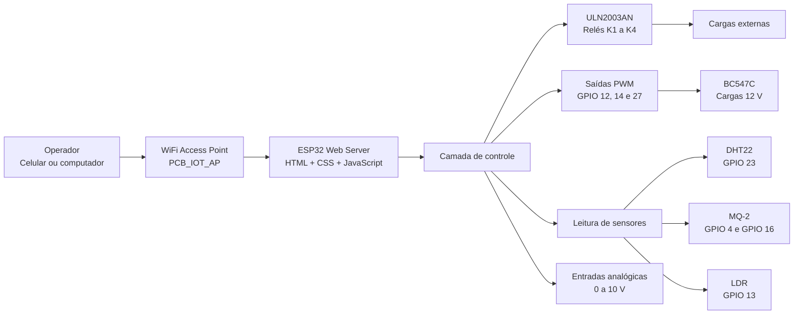
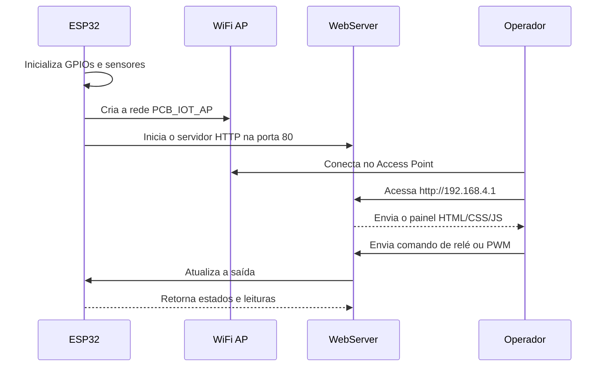
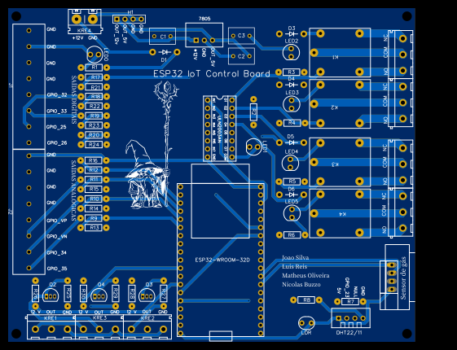
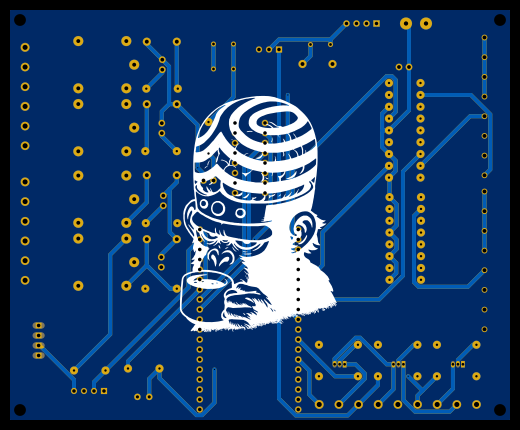
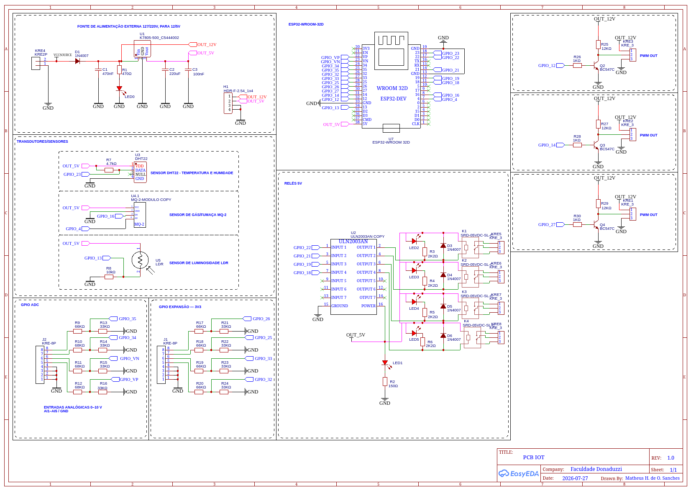

# PCB IoT — Automação e Monitoramento com ESP32

> Plataforma modular baseada no **ESP32-WROOM-32D** para controle de relés, saídas PWM, leitura de sensores e operação por um painel web local.


---

## Sumário

- [Sobre o projeto](#sobre-o-projeto)
- [Objetivos](#objetivos)
- [Arquitetura](#arquitetura)
- [Funcionalidades](#funcionalidades)
- [Hardware](#hardware)
- [Mapa de GPIOs](#mapa-de-gpios)
- [Estrutura do firmware](#estrutura-do-firmware)
- [Instalação](#instalação)
- [Uso do painel web](#uso-do-painel-web)
- [Rotas HTTP](#rotas-http)
- [Sensores](#sensores)
- [Relés e cargas](#relés-e-cargas)
- [Saídas PWM](#saídas-pwm)
- [Entradas analógicas](#entradas-analógicas)
- [Procedimento de testes](#procedimento-de-testes)
- [Solução de problemas](#solução-de-problemas)
- [Segurança](#segurança)
- [Limitações conhecidas](#limitações-conhecidas)
- [Evoluções futuras](#evoluções-futuras)
- [Imagens do projeto](#imagens-do-projeto)
- [Licença e autoria](#licença-e-autoria)

---

## Sobre o projeto

A **PCB IoT** foi desenvolvida como uma plataforma didática de automação baseada no microcontrolador **ESP32-WROOM-32D**. A placa reúne alimentação, sensores, entradas analógicas, quatro saídas a relé, três saídas PWM e pontos de expansão.

O firmware é desenvolvido em **C++**, utilizando **Arduino Framework** e **PlatformIO**. O ESP32 pode criar sua própria rede WiFi no modo **Access Point** e hospedar diretamente um painel web responsivo. Dessa forma, o operador consegue controlar e monitorar a placa localmente, sem depender de Internet ou roteador externo.

| Item | Informação |
|---|---|
| Projeto | PCB IoT — Automação e Monitoramento |
| Microcontrolador | ESP32-WROOM-32D |
| Plataforma de desenvolvimento | VS Code + PlatformIO |
| Framework | Arduino |
| Revisão do esquemático | 1.0 |
| Instituição | Faculdade Donaduzzi |
| Autor | Matheus H. de O. Sanches |

---

## Objetivos

- Desenvolver uma placa IoT modular para automação.
- Controlar quatro relés por uma interface web local.
- Disponibilizar três saídas PWM para cargas de baixa potência ou estágios externos.
- Ler temperatura e umidade com DHT22.
- Ler sinais relativos de gás/fumaça com MQ-2.
- Ler luminosidade com LDR.
- Disponibilizar entradas analógicas condicionadas para sinais de 0–10 V.
- Organizar o firmware em módulos reutilizáveis.
- Permitir operação local por Access Point.
- Documentar limitações, testes e cuidados de segurança.

---

## Arquitetura

O diagrama abaixo resume o fluxo entre operador, painel web, ESP32, sensores e atuadores.



### Fluxo de inicialização



---

## Funcionalidades

| Recurso | Descrição |
|---|---|
| Access Point | O ESP32 cria a rede WiFi local `PCB_IOT_AP`. |
| Painel web | Interface responsiva para celular e computador. |
| Relés | Controle individual dos relés K1, K2, K3 e K4. |
| PWM | Controle de três canais em escala de 0 a 255. |
| DHT22 | Leitura de temperatura e umidade do ar. |
| MQ-2 | Leitura analógica relativa e saída digital de alerta. |
| LDR | Leitura relativa de luminosidade. |
| Entradas 0–10 V | Canais condicionados por divisores resistivos. |
| JSON | Rota `/status` para integração com Python ou dashboards. |

---

## Hardware

### Componentes principais

| Componente | Referência | Função |
|---|---|---|
| ESP32-WROOM-32D | U7 | Processamento, WiFi e controle geral. |
| ULN2003AN | U2 | Driver das bobinas dos relés. |
| SRD-05VDC-SL-C | K1–K4 | Comutação de cargas externas. |
| DHT22 | U3 | Leitura de temperatura e umidade. |
| Módulo MQ-2 | U4.1 | Detecção relativa de gás/fumaça. |
| LDR | U5 | Leitura de luminosidade. |
| BC547C | Q2–Q4 | Estágios de chaveamento das saídas PWM. |
| K7805-500 | U1 | Regulação para 5 V. |
| 1N4007 | D1 e D3–D6 | Proteção/retificação conforme o esquema. |
| Resistores | R1–R30 | Limitação, polarização e divisores. |
| Capacitores | C1–C3 | Filtragem e desacoplamento. |

### Alimentação

O esquemático identifica uma alimentação externa para obtenção de `OUT_12V` e `OUT_5V`. O conector H1 disponibiliza:

| Pino H1 | Sinal |
|---:|---|
| 1 | `OUT_12V` |
| 2 | `OUT_5V` |
| 3 | `GND` |
| 4 | `GND` |

> **Atenção:** a entrada é identificada no esquemático como 127/220 Vac. A montagem deve incluir isolamento, proteção, fusível, gabinete adequado e procedimentos seguros. Realize os primeiros testes apenas com baixa tensão e sem cargas conectadas.

---

## Mapa de GPIOs

| Função | GPIO | Observação |
|---|---:|---|
| DHT22 DATA | 23 | Usa R7 de 4,7 kΩ como pull-up. |
| MQ-2 A0 | 4 | ADC2; pode conflitar com WiFi ativo. |
| MQ-2 D0 | 16 | Saída digital de limiar do módulo. |
| LDR | 13 | ADC2; pode conflitar com WiFi ativo. |
| Relé K1 | 22 | Entrada 1 do ULN2003AN. |
| Relé K2 | 21 | Entrada 2 do ULN2003AN. |
| Relé K3 | 19 | Entrada 3 do ULN2003AN. |
| Relé K4 | 18 | Entrada 4 do ULN2003AN. |
| PWM 1 | 12 | Estágio Q2 / BC547C. |
| PWM 2 | 14 | Estágio Q3 / BC547C. |
| PWM 3 | 27 | Estágio Q4 / BC547C. |
| Entradas AI | 34, 35, 39/VN, 36/VP, 26, 25, 32, 33 | Entradas condicionadas por divisores resistivos. |

---

## Estrutura do firmware

```text
PCB_IOT/
├── .gitignore
├── .vscode/
├── include/
│   ├── config.h
│   ├── pwm_control.h
│   ├── reles.h
│   ├── sensores.h
│   └── web_server.h
├── src/
│   ├── main.cpp
│   ├── pwm_control.cpp
│   ├── reles.cpp
│   ├── sensores.cpp
│   └── web_server.cpp
├── platformio.ini
└── README.md
```

### Responsabilidade dos módulos

| Arquivo | Responsabilidade |
|---|---|
| `include/config.h` | Pinos, credenciais do Access Point e constantes. |
| `src/main.cpp` | Inicialização geral e loop principal. |
| `src/reles.cpp` | Configuração e controle dos quatro relés. |
| `src/pwm_control.cpp` | Configuração LEDC e controle dos PWM. |
| `src/sensores.cpp` | Leitura de DHT22, MQ-2 e LDR. |
| `src/web_server.cpp` | HTML, CSS, JavaScript e rotas HTTP. |
| `platformio.ini` | Plataforma, placa, framework e dependências. |

---

## Instalação

### Pré-requisitos

- [Visual Studio Code](https://code.visualstudio.com/)
- Extensão **PlatformIO IDE**
- Cabo USB de dados
- ESP32-WROOM-32D ou placa configurada como `esp32dev`
- Fonte adequada e protegida para os testes

### Clonar o projeto

```bash
git clone https://github.com/Matheus44444/PCB_IOT.git
cd PCB_IOT
code .
```

### Compilar e gravar

1. Abra a pasta do projeto no VS Code.
2. Confira o arquivo `include/config.h`.
3. Conecte o ESP32 ao computador.
4. Clique em **Build** no PlatformIO.
5. Clique em **Upload**.
6. Abra o **Serial Monitor** em `115200 baud`.

### Dependências

No arquivo `platformio.ini`, mantenha as dependências:

```ini
lib_deps =
    adafruit/DHT sensor library@^1.4.6
    adafruit/Adafruit Unified Sensor@^1.1.14
```

---

## Uso do painel web

Após gravar o firmware:

1. Abra a lista de redes WiFi no celular ou computador.
2. Conecte-se à rede `PCB_IOT_AP`.
3. Informe a senha definida no arquivo `include/config.h`.
4. No navegador, acesse:

```text
http://192.168.4.1
```

A mensagem “sem Internet” é esperada: o ESP32 está oferecendo uma rede local e hospedando o site diretamente.

### Configuração do Access Point

```cpp
#define AP_SSID     "PCB_IOT_AP"
#define AP_PASSWORD "automacao123"
```

> Troque a senha padrão antes de demonstrar ou utilizar a placa fora do ambiente de testes.

### Controle dos relés

Os quatro relés podem ser acionados individualmente no painel. Comece os testes sem cargas conectadas aos contatos `COM`, `NO` e `NC`.

### Controle PWM

Os sliders controlam os canais em escala de 0 a 255:

- `0`: saída desligada
- `255`: duty cycle máximo

> Não conecte diretamente motores, bombas ou outras cargas de alta corrente às saídas PWM com BC547C. Para essas cargas, use MOSFET, driver externo ou relé adequadamente dimensionado.

---

## Rotas HTTP

| Rota | Exemplo | Função |
|---|---|---|
| `/` | `http://192.168.4.1/` | Exibe o painel principal. |
| `/rele` | `/rele?num=0&estado=1` | Liga/desliga relé. Índices de 0 a 3. |
| `/pwm` | `/pwm?num=0&valor=128` | Define PWM. Índices de 0 a 2. |
| `/status` | `/status` | Retorna estados e leituras em JSON. |

### Exemplo de resposta JSON

```json
{
  "reles": [true, false, false, false],
  "pwm": [128, 0, 0],
  "temperatura": 25.4,
  "umidade": 61.2,
  "gas": 742,
  "ldr": 1830
}
```

---

## Sensores

### DHT22 — temperatura e umidade

```text
VDD  -> OUT_5V
DATA -> GPIO23
GND  -> GND
```

O resistor R7 de 4,7 kΩ atua como pull-up entre alimentação e o pino DATA.

### MQ-2 — gás e fumaça

```text
VCC -> OUT_5V
GND -> GND
A0  -> GPIO4
D0  -> GPIO16
```

- `A0`: leitura analógica relativa.
- `D0`: saída digital baseada no limiar ajustado pelo potenciômetro do módulo.

A leitura analógica não representa ppm diretamente. Para obter uma concentração real, seriam necessários aquecimento, calibração em ar limpo, determinação de `R0` e curva de sensibilidade do fabricante.

### LDR — luminosidade

O LDR forma um divisor resistivo com R8 de 10 kΩ. O ponto de leitura vai ao GPIO13.

> Se o divisor for alimentado com 5 V, verifique a tensão no nó do GPIO. Entradas do ESP32 não são tolerantes a 5 V.

---

## Relés e cargas

```text
ESP32 GPIO22/21/19/18
          ↓
      ULN2003AN
          ↓
       K1/K2/K3/K4
          ↓
     Cargas externas
```

O ULN2003AN é um driver de coletor aberto. Quando o GPIO está ativo, o ULN2003 conduz a corrente da bobina do relé para GND. O pino `COM` do ULN2003 deve estar associado ao positivo das bobinas para que os diodos internos de proteção funcionem corretamente.

A corrente da carga externa percorre os contatos do relé, os conectores e as trilhas de potência — não o GPIO do ESP32. Portanto, confirme:

- Corrente nominal e de partida da carga
- Capacidade dos contatos do relé
- Largura das trilhas de potência
- Bitola dos fios
- Corrente disponível na fonte
- Uso de fusível e proteção contra surtos

---

## Saídas PWM

As saídas PWM estão associadas aos transistores BC547C:

| Canal | GPIO | Transistor | Saída |
|---|---:|---|---|
| PWM 1 | 12 | Q2 | `PWM OUT 1` |
| PWM 2 | 14 | Q3 | `PWM OUT 2` |
| PWM 3 | 27 | Q4 | `PWM OUT 3` |

Essas saídas são adequadas para sinais de controle ou cargas pequenas, desde que a corrente e a dissipação sejam analisadas. Para cargas indutivas, use diodo de roda livre e estágio externo apropriado.

---

## Entradas analógicas

Os canais de expansão utilizam divisores resistivos de aproximadamente 66/68 kΩ e 33 kΩ, projetados para reduzir sinais externos antes da leitura do ADC.

```text
Sinal externo ── resistor superior ── ponto ADC ── 33 kΩ ── GND
```

Antes de aplicar sinais de 0–10 V:

1. Confirme a razão do divisor no esquemático e na PCB.
2. Meça a tensão no pino ADC com multímetro.
3. Garanta que a tensão no ESP32 permaneça dentro da faixa segura.
4. Não aplique 5 V ou 10 V diretamente a um GPIO.

### Usar GPIO32/GPIO33 como entrada digital

Os conectores J1/J2 foram projetados como entradas analógicas e possuem resistores no caminho. Para transformá-los em entrada digital direta, é necessário remover o divisor correspondente e instalar jumper/resistor de 0 Ω conforme o roteamento real. Faça essa alteração somente após validar continuidade e isolamento com multímetro.

---

## Procedimento de testes

1. Inspecione a PCB e procure soldas em curto.
2. Sem cargas externas, meça `OUT_5V`, `OUT_12V` e GND.
3. Grave o firmware.
4. Confirme no Serial Monitor a criação do Access Point e o IP.
5. Acesse o painel pelo celular ou computador.
6. Teste os relés sem cargas externas.
7. Confirme clique mecânico e LEDs indicadores.
8. Teste DHT22.
9. Teste MQ-2 e LDR observando leituras relativas.
10. Teste PWM apenas com carga compatível.
11. Somente depois conecte cargas de maior potência.

### Teste mínimo de relé

Para isolar falhas do painel web, grave temporariamente este firmware:

```cpp
#include <Arduino.h>

#define PINO_RELE1 22

void setup() {
  Serial.begin(115200);
  pinMode(PINO_RELE1, OUTPUT);
  digitalWrite(PINO_RELE1, LOW);
}

void loop() {
  digitalWrite(PINO_RELE1, HIGH);
  Serial.println("K1 ligado");
  delay(3000);

  digitalWrite(PINO_RELE1, LOW);
  Serial.println("K1 desligado");
  delay(3000);
}
```

Se K1 não clicar neste teste, investigue alimentação de 5 V, ULN2003, continuidade, diodo de proteção, relé e orientação dos componentes antes de alterar o painel web.

---

## Solução de problemas

### O projeto não compila

- Execute **PlatformIO: Clean** e depois **Build**.
- Confirme que `platformio.ini` está na raiz do projeto.
- Confirme que headers estão em `include/`.
- Não cole HTML ou JavaScript fora de uma string C++.
- Verifique se não há funções duplicadas em arquivos `.cpp`.

### O site não abre

- Conecte-se à rede `PCB_IOT_AP`.
- Use `http://192.168.4.1`, e não HTTPS.
- Confira o IP no Serial Monitor.
- Pressione RESET e aguarde a inicialização do Access Point.

### O relé não aciona

- Confirme a presença de `OUT_5V`.
- Confirme o GND do ULN2003AN.
- Confira a orientação do CI ULN2003AN.
- Verifique continuidade entre GPIO22 e entrada 1 do ULN2003AN.
- Confirme bobina do relé e diodo de proteção.
- Meça a saída do ULN2003: ela deve ser puxada para GND quando ativa.

### MQ-2 e LDR instáveis

GPIO4 e GPIO13 pertencem ao **ADC2** do ESP32 clássico. Como o ADC2 é compartilhado com o WiFi, essas leituras podem ficar indisponíveis ou instáveis enquanto o Access Point estiver ativo.

Além disso, sensores alimentados em 5 V podem entregar tensão acima de 3,3 V. Use condicionamento adequado ou ADC1/ADC externo em revisões futuras.

### ESP32 reinicia ao acionar carga

- Verifique queda na fonte.
- Separe trilhas de potência e lógica.
- Reforce GND e `OUT_5V`.
- Confira corrente de partida da carga.
- Use desacoplamento e proteção adequados.

---

## Segurança

- Não toque na PCB energizada.
- Não teste rede elétrica sem isolamento e proteção.
- Use fusível na alimentação das cargas.
- Não ligue motores ou bombas diretamente ao BC547C.
- Não aplique 5 V diretamente a GPIOs do ESP32.
- Use diodo de roda livre em cargas DC indutivas quando necessário.
- Mantenha água afastada da parte de rede elétrica.
- Faça testes iniciais com baixa tensão e sem carga.
- Utilize caixa, bornes e cabos apropriados para a corrente e tensão das cargas.

---

## Limitações conhecidas

1. MQ-2 A0 no GPIO4 utiliza ADC2.
2. LDR no GPIO13 utiliza ADC2.
3. ADC2 pode apresentar falhas de leitura com WiFi ativo.
4. Percentuais de MQ-2 e LDR são relativos sem calibração.
5. O Access Point local não fornece Internet.
6. Entradas analógicas precisam ser validadas para a tensão real aplicada.
7. Saídas PWM com BC547C não são estágios universais de potência.
8. O firmware não substitui proteções elétricas e de segurança de hardware.

---

## Evoluções futuras

- Migrar MQ-2 e LDR para ADC1 ou ADC externo.
- Adicionar autenticação ao painel web.
- Armazenar configurações em Preferences/NVS.
- Adicionar watchdog e estado seguro após reinicialização.
- Integrar MQTT ou dashboard Python.
- Adicionar medição de corrente e tensão.
- Implementar logs de eventos e leituras.
- Revisar trilhas e conectores de potência para cargas maiores.
- Criar gabinete e etiquetas definitivas.
- Adicionar testes automatizados dos módulos de firmware.

---

## Imagens do projeto

Crie a pasta abaixo no repositório para organizar fotos, renderizações e capturas de tela:

```text
docs/
└── images/
    ├── pcb-3d-top.png
    ├── pcb-3d-bottom.png
    ├── pcb-montada.jpg
    ├── esquematico.png
    ├── painel-web.png
    └── montagem-bancada.jpg
```

Depois de adicionar os arquivos, as imagens aparecerão automaticamente neste README.

### Vista 3D superior

<!-- Salve a imagem como: docs/images/pcb-3d-top.png -->


### Vista 3D inferior

<!-- Salve a imagem como: docs/images/pcb-3d-bottom.png -->


<!-- ### PCB montada -->

<!-- Salve a imagem como: docs/images/pcb-montada.jpg -->
<!--  -->

### Esquemático

<!-- Salve a imagem como: docs/images/esquematico.png -->


<!-- ### Painel web -->

<!-- Salve a imagem como: docs/images/painel-web.png -->
<!--  -->

<!-- ### Montagem de bancada -->

<!-- Salve a imagem como: docs/images/montagem-bancada.jpg -->
<!--  -->

---

## Licença e autoria

Este repositório foi desenvolvido para fins acadêmicos, didáticos e experimentais.

- **Autor principal:** Matheus H. de O. Sanches
- **Projeto:** PCB IoT
- **Instituição:** Faculdade Donaduzzi
- **Revisão do esquemático:** 1.0
- **Uso:** acadêmico, didático e experimental

Antes de utilizar o circuito em instalações reais, faça validação elétrica, térmica, mecânica e de segurança.
